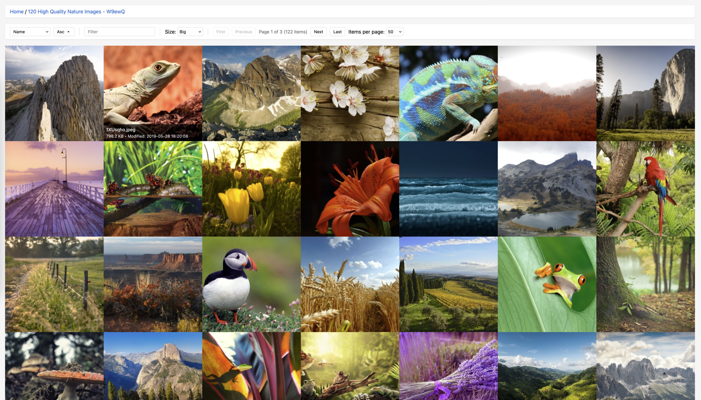
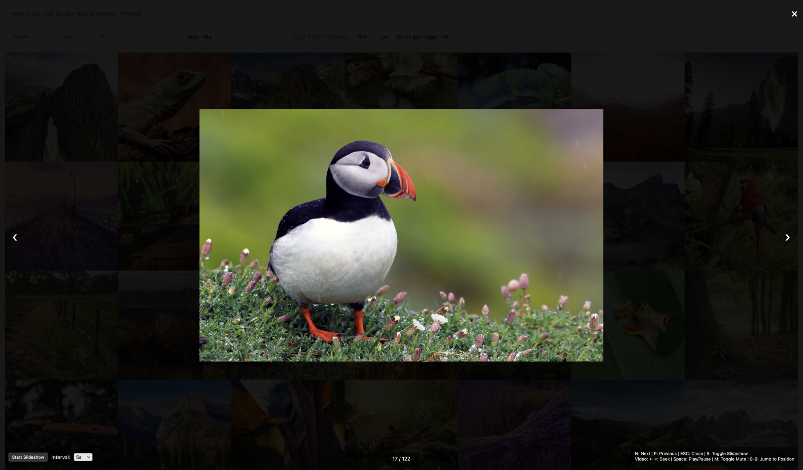

# Flask Gallery Server

A simple and dynamic Flask server that serves a directory as an image and video gallery with on-the-fly thumbnail generation.





## Features

- Browse directories and view images/videos in a responsive grid layout
- On-the-fly thumbnail generation for images and videos
- Video thumbnail generation using ffmpeg
- Supports common image formats (jpg, jpeg, png, gif) and video formats (mp4, mov, avi)
- Breadcrumb navigation
- Clean and modern UI
- Configurable thumbnail cache location
- Caches thumbnails for better performance
- Highly configurable through config.py
- Local Docker support with volume mounting for gallery and cache

## Requirements

- Python 3.7+ (if running directly)
- ffmpeg (for video thumbnail generation)
- libmagic (for file type detection)
- Docker (if running in container)

## Installation

### Option 1: Direct Installation

1. Install system dependencies:

   ```bash
   # On macOS
   brew install ffmpeg libmagic

   # On Ubuntu/Debian
   sudo apt-get install ffmpeg libmagic1
   ```

2. Install Python dependencies:

   ```bash
   pip install -r requirements.txt
   ```

3. Set up configuration:

   ```bash
   # Copy the example config file
   cp config.py.example config.py

   # Edit config.py with your settings
   nano config.py
   ```

### Option 2: Local Docker Build

1. Clone the repository:

   ```bash
   git clone https://github.com/maluramichael/python-gallery
   cd python-gallery
   ```

2. Build the Docker image locally:

   ```bash
   docker build -t python-gallery .
   ```

3. Run the container:

   ```bash
   docker run -d \
     -p 5000:5000 \
     -v /path/to/your/gallery:/app/gallery \
     -v /path/to/cache:/app/.cache \
     python-gallery
   ```

   The container uses two volume mounts:
   - `/app/gallery`: Mount your media directory here
   - `/app/cache`: Mount your cache directory here for persistent thumbnails

   Example with specific paths:
   ```bash
   docker run -d \
     -p 5000:5000 \
     -v /home/user/Pictures:/app/gallery \
     -v /home/user/cache/gallery:/app/.cache \
     python-gallery
   ```

   Note: Make sure the mounted directories have the correct permissions for the container to read/write.

## Usage

### Direct Usage

1. Run the Flask server:

   ```bash
   python app.py
   ```

2. Open your browser and navigate to:

   ```
   http://localhost:5000
   ```

### Docker Usage

The server will be available at:

```
http://localhost:5000
```

## Configuration

The config.py file allows you to configure:
- Server host and port
- Gallery root directory
- Cache directory location
- Thumbnail size and quality
- Allowed file extensions
- Minimum file size
- Ignored files and directories
- Items per page
- Default sort order
- Cache duration and size limits
- Video thumbnail settings
- Download permissions and size limits

## Security Notes

- The server implements basic security measures to prevent directory traversal attacks
- The root directory is restricted to the specified GALLERY_ROOT in config.py
- Thumbnails are cached in the configured CACHE_DIR
- File downloads can be restricted by size and permission in config.py
- When using Docker, ensure proper permissions on mounted volumes

## License

MIT License 